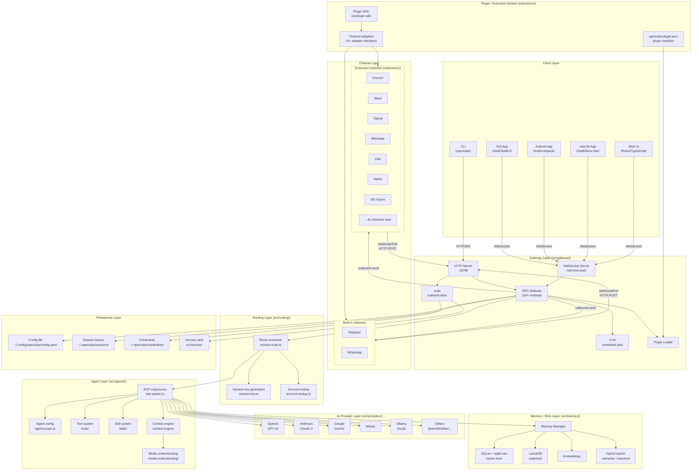
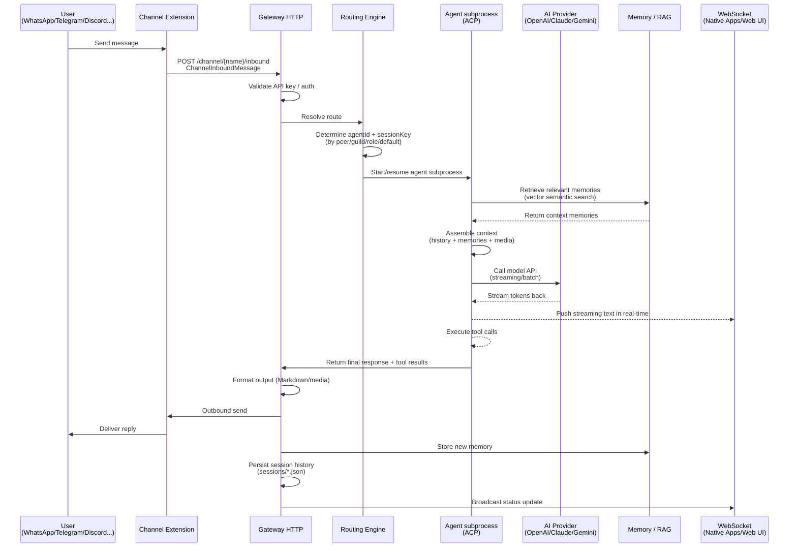
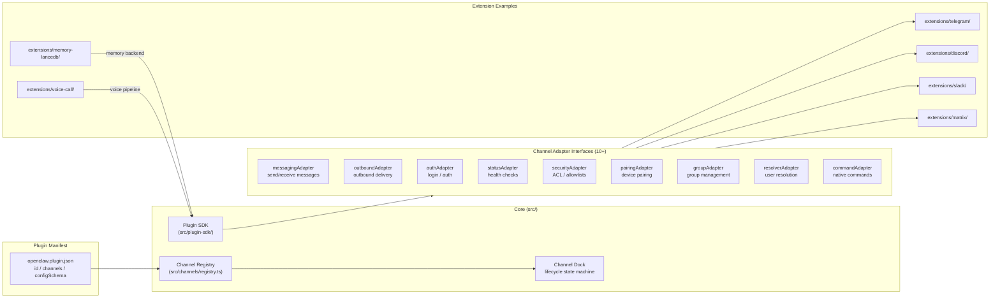
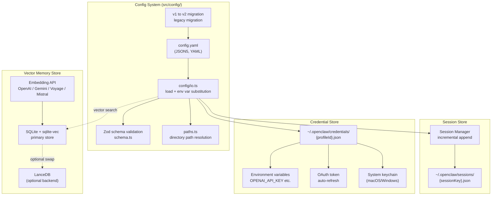
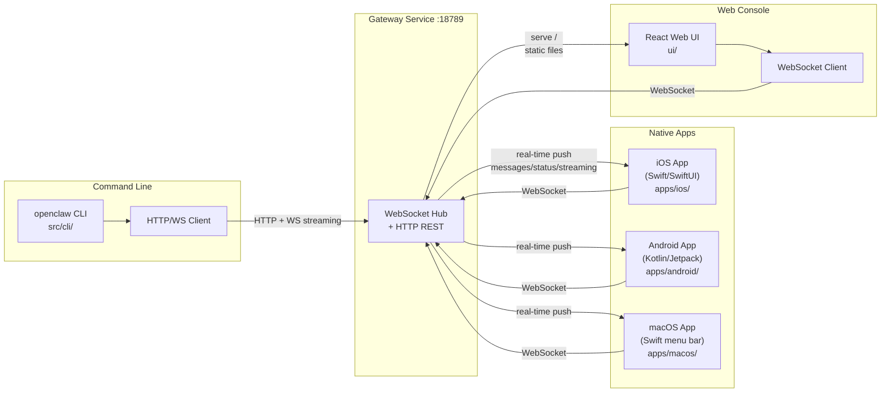

# Technical Architecture

This document describes the overall technical architecture of OpenClaw using Mermaid diagrams, covering all layers and their interactions.

## System Overview

---

## Message Processing Flow

---

## Plugin Architecture

---

## Configuration and Storage Architecture

---

## Multi-Platform Client Architecture

---

## Component Responsibilities

| Layer | Module | Responsibility |
|-------|--------|----------------|
| **Client** | iOS / Android / macOS App | Native UI, persistent WebSocket connection, offline message queue |
| **Client** | Web UI (React) | Browser-based control plane, real-time config, model management |
| **Client** | CLI | Command-line interface, scripting, development tooling |
| **Gateway** | HTTP Server | REST endpoints, WebSocket upgrade, plugin HTTP routing |
| **Gateway** | WebSocket Server | Bidirectional real-time push, client state sync |
| **Gateway** | RPC Methods | 100+ methods: chat / config / memory / channels / plugins |
| **Gateway** | Cron Service | Scheduled tasks, auto-replies, periodic maintenance |
| **Channel** | Channel Extensions | Message adapter, inbound webhook/polling, outbound formatting |
| **Routing** | Routing Engine | Message-to-agent mapping, session key generation, multi-agent dispatch |
| **Agent** | ACP subprocess | LLM calls, tool execution, streaming responses, session management |
| **Agent** | Tools / Skills | Pluggable tools (search, code execution, file I/O, etc.) |
| **AI Provider** | Provider integrations | OpenAI / Anthropic / Gemini / Mistral / Ollama / ... |
| **Memory** | Memory / RAG | Vector search, semantic retrieval, long-term memory persistence |
| **Persistence** | Config / Sessions / Secrets | YAML config, JSON session history, encrypted credentials |
| **Plugin System** | Plugin SDK + Manifest | Standardized extension interface, dynamic loading, HTTP route mounting |
